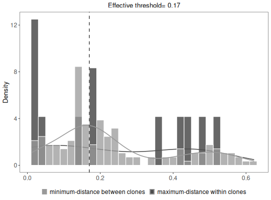

**spectralClones** - *Spectral clustering-based method for partitioning Ig sequences into clones.*

Description
--------------------

The `spectralClones` function provides an unsupervised computational pipline for assigning Ig 
sequences into clonal groups sharing same V gene, J gene, and junction length, based on the 
junction sequence similarity and shared mutations in V and J segments.


Usage
--------------------
```
spectralClones(
db,
method = c("novj", "vj"),
germline = "germline_alignment",
sequence = "sequence_alignment",
junction = "junction",
v_call = "v_call",
j_call = "j_call",
clone = "clone_id",
targeting_model = NULL,
len_limit = NULL,
first = FALSE,
cdr3 = FALSE,
mod3 = FALSE,
max_n = 0,
threshold = NULL,
base_sim = 0.95,
iter_max = 1000,
nstart = 1000,
nproc = 1,
verbose = FALSE,
log = NULL,
summarize_clones = FALSE
)
```

Arguments
-------------------

db
:   data.frame containing sequence data.

method
:   one of the `"novj"` or `"vj"`. See Details for description.

germline
:   character name of the column containing the germline or reference sequence.

sequence
:   character name of the column containing input sequences.

junction
:   character name of the column containing junction sequences.
Also used to determine sequence length for grouping.

v_call
:   character name of the column containing the V-segment allele calls.

j_call
:   character name of the column containing the J-segment allele calls.

clone
:   the output column name containing the clone ids.

targeting_model
:   [TargetingModel](http://www.rdocumentation.org/packages/shazam/topics/TargetingModel-class) object. Only applicable if `method` = `"vj"`. 
See Details for description.

len_limit
:   [IMGT_V](http://www.rdocumentation.org/packages/shazam/topics/IMGT_SCHEMES) object defining the regions and boundaries of the Ig 
sequences. If NULL, mutations are counted for entire sequence. Only 
applicable if `method` = `"vj"`.

first
:   specifies how to handle multiple V(D)J assignments for initial grouping. 
If `TRUE` only the first call of the gene assignments is used. 
If `FALSE` the union of ambiguous gene assignments is used to 
group all sequences with any overlapping gene calls.

cdr3
:   if `TRUE` removes 3 nucleotides from both ends of `"junction"` 
prior to clustering (converts IMGT junction to CDR3 region). 
If `TRUE` this will also remove records with a junction length 
less than 7 nucleotides.

mod3
:   if `TRUE` removes records with a `junction` length that is not divisible by 
3 in nucleotide space.

max_n
:   the maximum number of N's to permit in the junction sequence before excluding the 
record from clonal assignment. Default is set to be zero. Set it as `"NULL"` 
for no action.

threshold
:   the upper-limit cut-off for clonal grouping.

base_sim
:   required similarity cut-off for sequences in equal distances from each other.

iter_max
:   the maximum number of iterations allowed for kmean clustering step.

nstart
:   the number of random sets chosen for kmean clustering initialization.

nproc
:   number of cores to distribute the function over.

verbose
:   if `TRUE` prints out a summary of each step cloning process.
if `FALSE` (default) process cloning silently.

log
:   specify the output path/filename.txt to save `verbose`. 
The input file directory is used if path is not specified.
The default is `NULL` for no action.

summarize_clones
:   if `TRUE` performs a series of analysis to assess the clonal landscape.
See Value for description.


Value
-------------------

For `summarize_clones=FALSE`, a modified data.frame with clone identifiers in the `clone` column. 
For `summarize_clones=TRUE` returns a [ScoperClones](ScoperClones-class.md) object including the modified `db` 
with clone identifiers, and other clones summary information.
If `log` is specified as output path/filename.txt, it will write verbose logging to a file in the output path. 
If `log` is specified as only a filename.txt, current directory is used. The default is `NULL` for no action.


Details
-------------------

`spectralClones` provides a computational platform to explore the B cell clonal 
relationships in high-throughput Adaptive Immune Receptor Repertoire sequencing (AIRR-seq) 
data sets. Two methods are included to perform clustering among sequences of B cell receptors 
(BCRs, immunoglobulins, Ig) that share the same V gene, J gene and junction length: 

+  If `method` = `"novj"`: clonal relationships are inferred using an adaptive threshold that 
indicates the level of similarity among junction sequences in a local neighborhood. 
+  If `method` = `"vj"`: clonal relationships are inferred not only based on the junction region 
homology, but also takes into account the mutation profiles in the V and J segments. Mutation counts are 
determined by comparing the input sequences (in the column specified by `sequence`) to the effective 
germline sequence (IUPAC representation of sequences in the column specified by `germline`). 
+  Not mandatory, but the influence of SHM hot- and cold-spot biases in the clonal inference process will be noted 
if a SHM targeting model is provided through argument `targeting_model` (see [createTargetingModel](http://www.rdocumentation.org/packages/shazam/topics/createTargetingModel) 
for more technical details). 
+  Not mandatory, but the upper-limit cut-off for clonal grouping can be provided to
prevent sequences with disimilarity above the threshold group together. Using this argument any sequence with  
distances above the `threshold` value from other sequences, will become a singleton.


Examples
-------------------

```R
results <- spectralClones(ExampleDb, method="vj", 
germline="germline_alignment_d_mask", 
sequence="sequence_alignment", 
junction="junction", v_call="v_call", 
j_call="j_call", threshold=0.15, summarize_clones=TRUE)

```


```
     MAX N FILTER>  0 invalid junction(s) ( # of N > 0 ) in the junction column removed. 

```


```R

# Plot clonal summaries 
p <- plotCloneSummary(results, binwidth=0.02)

```



```R
plot(p)
```


See also
-------------------

See [plotCloneSummary](plotCloneSummary.md) for generating a ggplot object from `summarize_clones=TRUE`
method.


